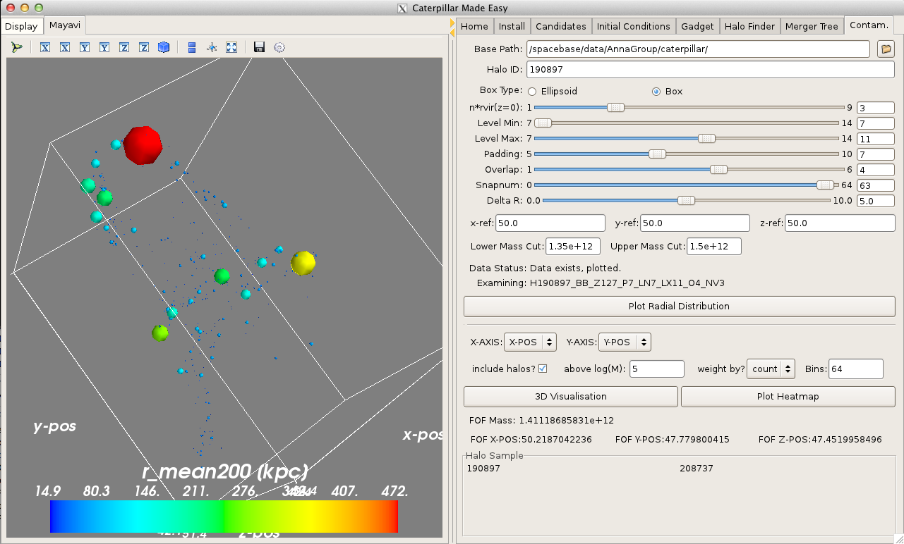
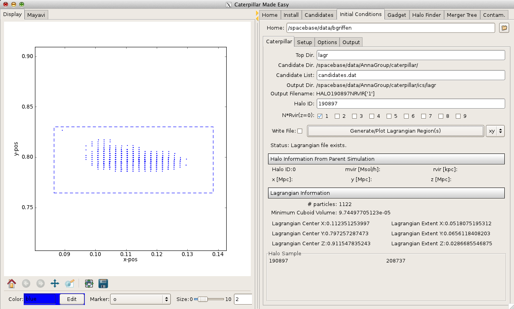
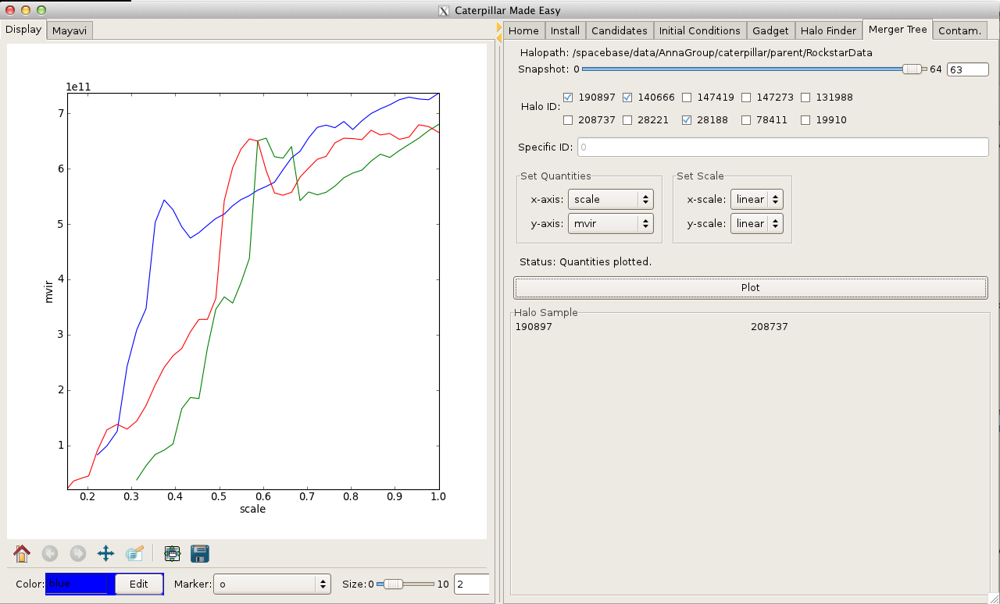
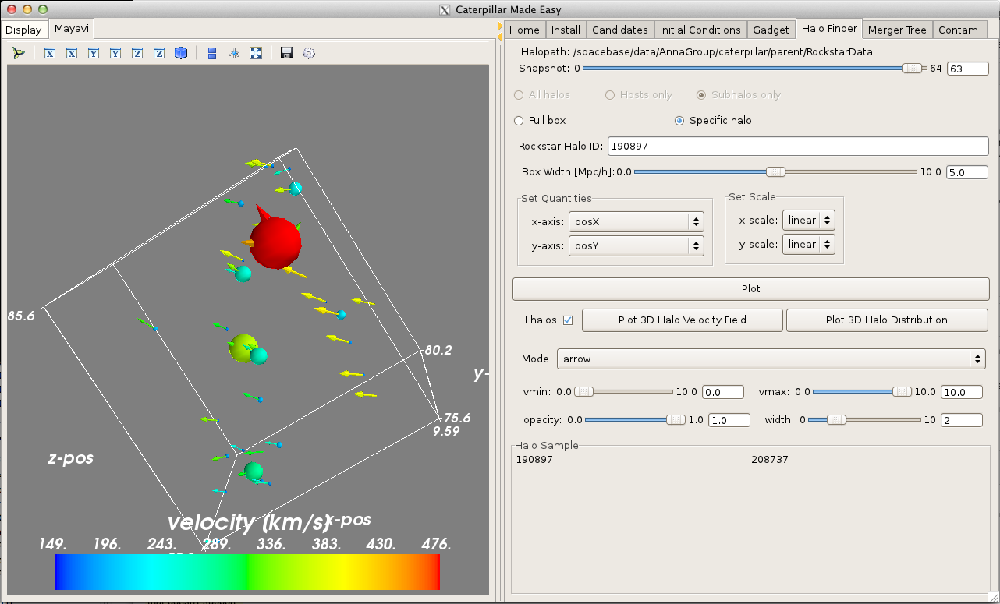
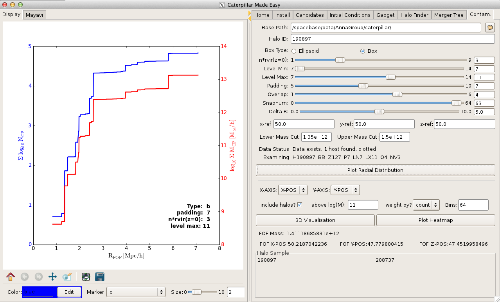
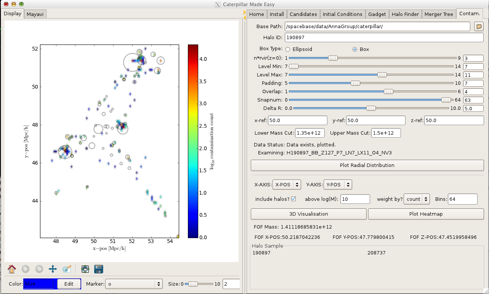
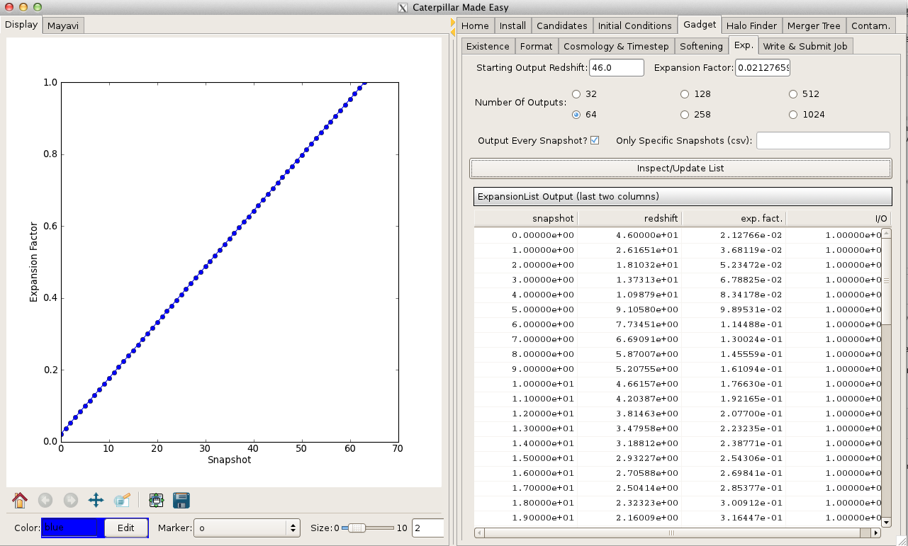
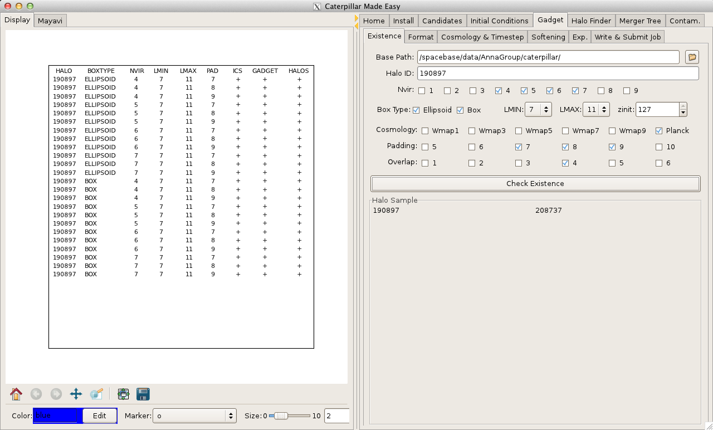
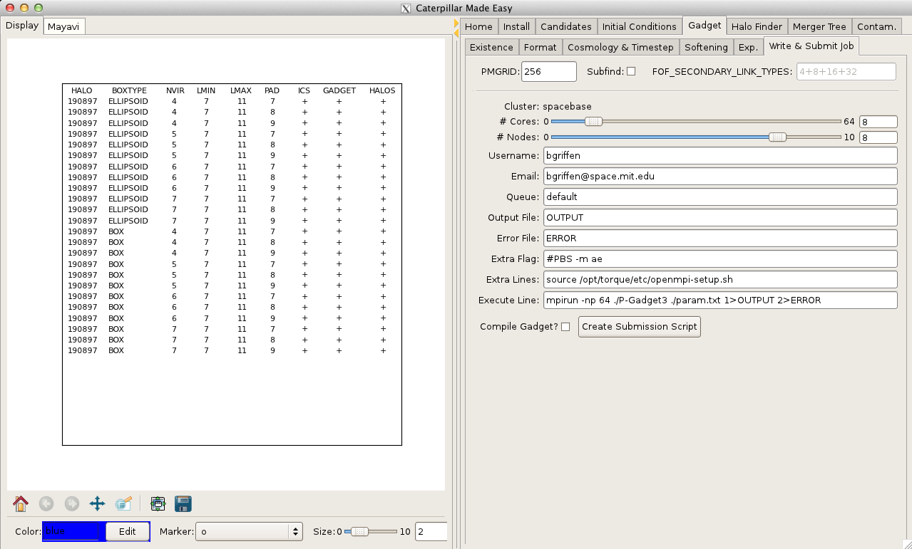

CME: Caterpillar Made Easy
===

Interactive suite to do the following tasks for the Caterpillar Project being carried out at MIT/Harvard:

* generate list of candidates based on tunable isolation and merger history criteria
* inspect lagrangian region properties (e.g. size, volume, morphology)
* contruct initial conditions for cosmological simulations using MUSIC (Hahn & Abel 2010).
* run cosmological simulations using P-Gadget3.
* examine contamination of low-resolution particles in resimulation across suite
* create heatmaps of contamination in every projection
* do 3D visualisations of halo and particle velocity field and positions
* submit job via both PBS and SLURM submission systems.

Not a single line of code is required by the user. 

The packaged utilizes a number of suites which come with EPD distribution (e.g. Traits, Pandas) which is required for the package to work. A number of read modules are not included for Gadget files and the Rockstar halo catalogues. Although it is for the *Caterpillar Project*, it can in principle work on any cosmological simulation suite. 

Please contact [brendan.f.griffen@gmail.com](mailto:brendan.f.griffen) if you would like to use this software for your simulation suites.

## Examples

#### Candidate Selection

#### Inspect & Generate Lagrangian Regions

#### Inspect Merger Trees

#### Examing Halo Distributions Interactively  (via Mayavi)

#### Examing Halo Velocity Field Interactively (via Mayavi)

#### Examine Contamination Quality

#### Examine Contamination Quality (via heatmap)

#### Specify All Gadget Parameters (temporal resolution etc.)

#### Investigate inter-halo relations from Rockstar halo catalogue

#### Run full suites with varied initial conditions 
##### (e.g. to determine how resolution effects contamination rate)

#### Submit jobs to cluster via PBS or SLURM

